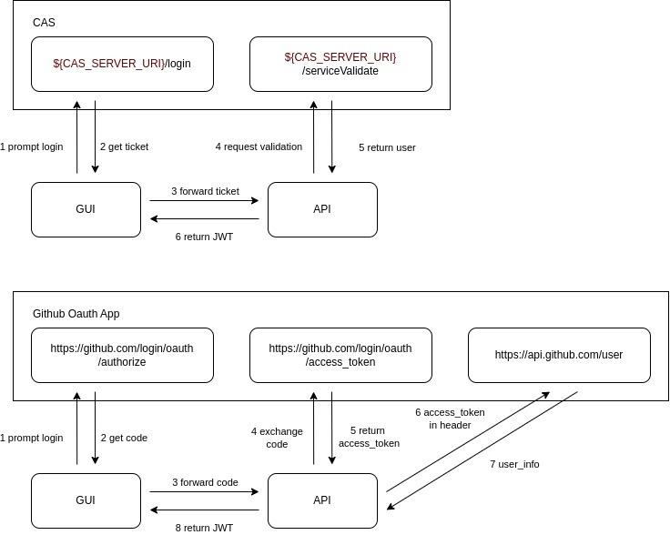

.. _authGuide:

Authentication and Authorization
=======================================

Authentication
----------------

The Authentication module works with a third-party authentication service. The Autosubmit API implements 2 types of authentication services: **CAS** and **OAuth2 with GitHub**. For Authorization, the API uses GitHub Organization and Teams to whitelist users only when GitHub auth is enabled.

   Authentication processes

The API offers these endpoints to authenticate users:

- CAS Login: ``GET /v4/auth/cas/v2/login``
- Github Oauth2 Login: ``GET /v4/auth/oauth2/github/login``
- Verify JWT token (generated from any of the previous endpoints): ``GET /v4/auth/verify-token``

The **Login endpoints** will generate a JWT token with its ``Bearer`` prefix (version >= 4.0.1b4) that will be used to authenticate the user in the API. This tokens will last 5 days.

.. important:: You must to set up the environment variable ``SECRET_KEY`` in production environments to generate the custom token securely.

CAS
^^^^^

Regarding the API, the key points to enable **CAS** are:

- You need to set up the environment variables with prefix ``CAS_`` as it is explained in :ref:`configuration` which identifies the third-party authentication service.
- You need to add your authorized (allowed to be authenticated) URLs to the ``.autosubmitrc`` configuration under

    In the example below, ``https://myhost.com/`` has been previously authorized to request authentication from **CAS**; and, by this setting, it is also authorized to be part of the authentication process at the ``API`` level.
    
    .. code-block:: bash

        [clients]
        authorized = https://myhost.com/      

GitHub Oauth App
^^^^^^^^^^^^^^^^^^^^

To se tup the **GitHub OAuth App** authentication, you need to:

- Create a GitHub OAuth App in your GitHub account.
- Set up the environment variables with prefix ``GITHUB_OAUTH_CLIENT_`` as it is explained in :ref:`configuration` which identifies the third-party authentication service.
- In case of whitelist users, you need to set up the environment variable ``GITHUB_OAUTH_WHITELIST_ORGANIZATION`` or ``GITHUB_OAUTH_WHITELIST_TEAM`` with the name of the organization/team in GitHub.