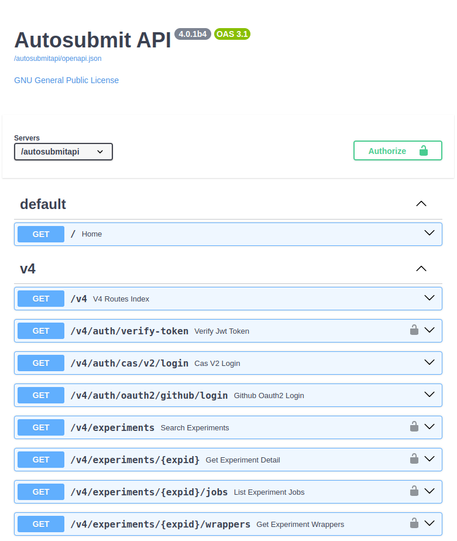

.. _openapiGuide:

OpenAPI and Swagger UI
=======================================

The API documentation is generated automatically from the API code and is available at these endpoints:

- OpenAPI: ``/openapi.json``
- Swagger UI: ``/docs``
- Redoc: ``/redoc``

The OpenAPI specification is generated using the FastAPI library and the Swagger UI and Redoc are served by the FastAPI library as well.

.. note:: You might need to set the environment variable ``AS_API_ROOT_PATH`` if you are serving the API with a reverse proxy to make the Swagger UI and Redoc work properly.

   Swagger UI generated by the API
